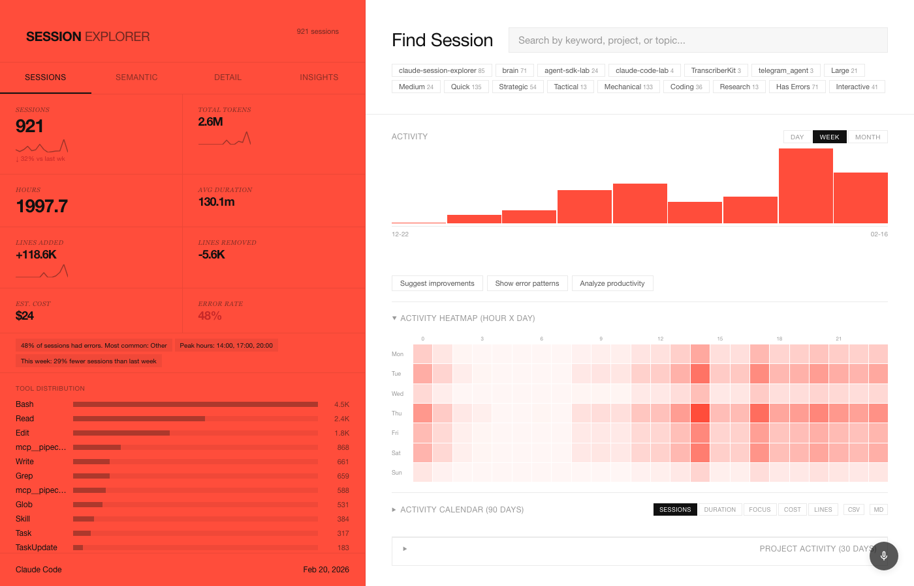
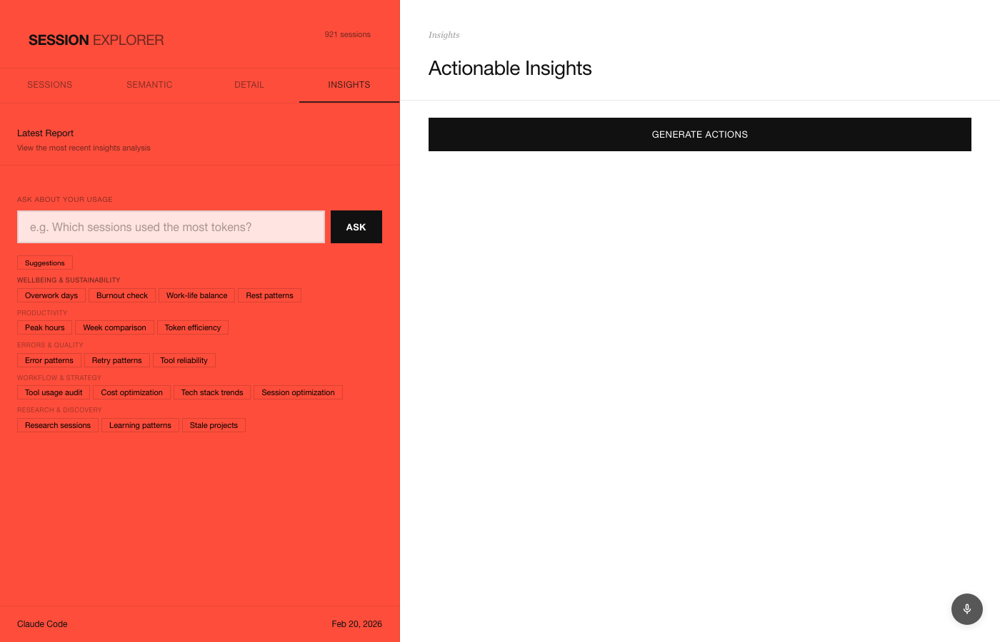

# Session Explorer

A visual dashboard for analyzing your Claude Code sessions. Surfaces usage patterns, costs, productivity trends, and wellbeing signals from local session data.



## Features

**Dashboard** -- aggregate stats (sessions, tokens, hours, cost, error rate), activity chart with day/week/month granularity, tool distribution, sparkline trends, and quick insight filters by project, size class, and work type.

**Activity visualizations** -- hour-by-day heatmap, 90-day calendar (switchable between sessions/duration/focus/cost/lines modes), project activity swimlane, and wellbeing strip tracking late-night/weekend work.

**Smart filters** -- filter sessions by project, size class (large/medium/quick), work type (strategic/tactical/mechanical), style (coding/research/interactive), and error status. Combine multiple filters.

**Semantic search** -- search sessions by meaning, not just keywords. Powered by embeddings generated from session transcripts.

**Session detail** -- full transcript viewer with syntax-highlighted markdown, tool call inspection, and per-session cost/token breakdown.

**AI insights agent** -- ask questions about your usage in natural language. Preset categories include:

- **Wellbeing & Sustainability** -- overwork detection, burnout signals, work-life balance, rest patterns
- **Productivity** -- peak hours, week-over-week comparison, token efficiency
- **Errors & Quality** -- error patterns, retry analysis, tool reliability
- **Workflow & Strategy** -- tool audit, cost optimization, tech stack trends
- **Research & Discovery** -- research sessions, learning patterns, stale projects

**Voice control** -- speak commands to filter, search, navigate, or ask insight questions via browser speech recognition.

**Reports** -- generated insights are saved as report cards with expand/collapse, markdown export, PDF export, regenerate, and delete.

**Calendar export** -- export calendar data as CSV or Markdown.



## Prerequisites

- [Node.js](https://nodejs.org/) 20+
- [Claude Code CLI](https://docs.anthropic.com/en/docs/claude-code) installed and authenticated
- Session data in `~/.claude/usage-data/session-meta/`

## Setup

```bash
git clone https://github.com/glebis/claude-session-explorer.git
cd claude-session-explorer
npm install
```

## Usage

```bash
npm run dev
```

Opens at [http://localhost:3000](http://localhost:3000).

The dashboard reads session metadata from your local Claude Code data directory. No data leaves your machine unless you use the AI insights agent (which calls the Claude API via the Agent SDK).

### Optional: Generate embeddings for semantic search

```bash
npm run embed
```

This processes session transcripts into vector embeddings stored in a local PostgreSQL database, enabling the semantic search tab.

## Architecture

```
server.ts        Express server, API routes, Agent SDK integration
tools.ts         MCP tools, session parsing, embeddings
public/index.html  Monolithic frontend (HTML + CSS + JS)
embedder.ts      Batch embedding generator for semantic search
```

- **`/api/stats`** -- aggregated dashboard statistics from session-meta files
- **`/api/sessions`** -- paginated session list with filtering
- **`/api/ask`** -- SSE endpoint streaming Agent SDK responses for the insights agent
- **`/api/transcript/:id`** -- full session transcript

The insights agent uses the [Claude Agent SDK](https://www.npmjs.com/package/@anthropic-ai/claude-agent-sdk) with MCP tools to query session data and generate analysis. It runs as a Haiku subprocess for fast, cost-effective responses.

## License

MIT
